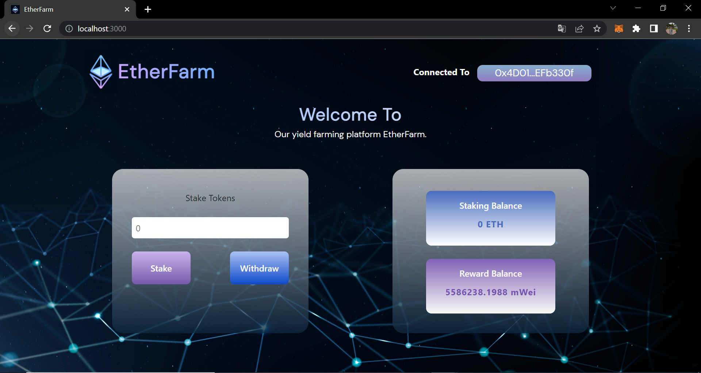

# EtherFarm
A simple DeFi yield farming app.

# What is DeFi yield farming?
In simple terms, DeFi yield farming is an investment process. Suppose you have $1000 worth of crypto with you. You can pledge your crypto asset in a yield farming platform and earn interest for the pledged amount. What makes it interesting is that the crypto you pledge would be used for providing liquidity of assets for traders in the platform. 

# ScreenShot

